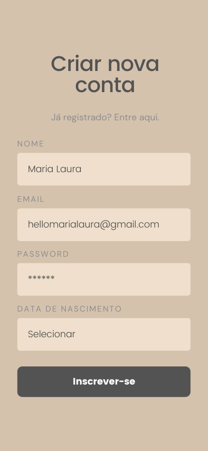

# Protótipo de média fidelidade

Projeto realizado como exercício no curso de UX da DIO.
Construi um wireframe tendo em conta os fundamentos de usabilidade, usando a plataforma Canva.

# Design System 

Construi um Design System a partir do protótipo de média fidelidade, usando assim a paleta das seguintes cores neutras:

#D4C2AD;
#535353;
#8F8E8E;
#EFDFCC;
#FFFFFF.

